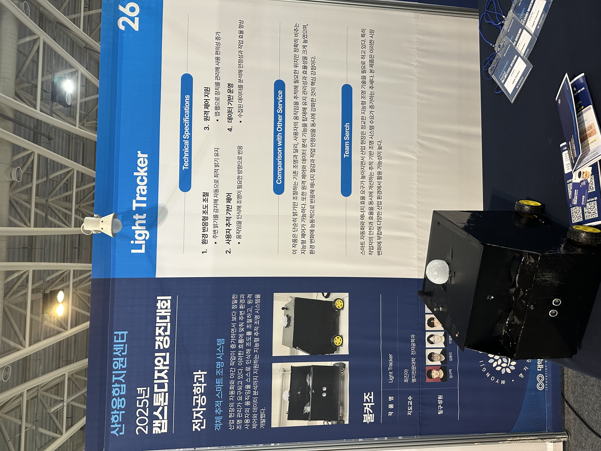

# Smart Tracking Light Robot
**야간 작업자를 위한 객체 추적 스마트 조명 시스템**



## 수상
2025 캡스톤디자인 장려상

---

## 프로젝트 핵심

### 문제점
- 야간 작업 중 조명 조작의 불편함과 위험성
- 고정된 조명으로 인한 작업 효율 저하
- 수동 제어의 번거로움

### 해결책
- **객체 추적 기술** → 사용자 자동 추적
- **음성 인식** → 핸즈프리 제어
- **원격 제어** → 앱/웹 통합 관리

---

## 시스템 개요

| 구분 | 내용 |
|------|------|
| **팀명** | 불켜조 (5인) |
| **제작 기간** | 2025년 3월 ~ 6월 (4개월) |
| **프로젝트 유형** | IoT 기반 스마트 조명 로봇 |
| **산업체 멘토** | 유니로드 주식회사 / 김O 수석연구원 |
| **핵심 기술** | 객체 인식, 자동 추적, 음성 제어 |

---

## 주요 기능

### 1. 객체 추적 (TRACK 모드)
- AI 기반 사람 인식 (MobileNet SSD v2)
- 실시간 추적 및 자동 이동
- 장애물 감지 (초음파, 적외선)

### 2. 원격 제어 (REMOTE/MANUAL 모드)
- 스마트폰 앱 제어
- 웹 대시보드
- 실시간 영상 스트리밍

### 3. 음성 인식
- 한국어 음성 명령 ("켜기", "끄기", "전진", "정지")
- Google Speech API
- 핸즈프리 작업 환경

### 4. 자동 조명 제어
- 조도센서 기반 자동 밝기 조절
- RGB LED (색상/밝기 조정)
- 일정 예약 기능

---

## 내가 맡은 역할 (김동진)

### 소프트웨어 총괄 (100%)

**1. Spring Boot API 서버 (Kotlin)**
- RESTful API 설계 및 구현
- MariaDB 연동 (JPA)
- Spring Security 인증/인가
- 모바일 앱 API 제공
- 라즈베리파이 통신 API

**2. Raspberry Pi 제어 (Python)**
- 객체 추적 시스템 (OpenCV, TensorFlow Lite)
- 모터 제어 (4륜 구동, PWM)
- 음성 인식 (Google Speech API)
- Spring Boot 서버 실시간 통신

**3. Arduino (C/C++)**
- RGB LED PWM 제어
- 조도센서 데이터 처리
- Serial 통신

**4. 인프라 구축**
- Ubuntu VM + MariaDB
- Nginx 리버스 프록시
- DuckDNS + Certbot (HTTPS)
- 포트포워딩 설정

**5. 서기**
- 회의록 작성
- 문서화

---

## 기술 스택

### Backend
- **Spring Boot 3.2.5** + Kotlin
- **MariaDB** (JPA)
- Spring Security
- RESTful API

### Embedded
- **Raspberry Pi 4** + Python
- **Arduino Uno** + C/C++
- GPIO, PWM, Serial

### AI/ML
- **TensorFlow Lite** (MobileNet SSD v2)
- **OpenCV** (객체 추적)
- Google Speech Recognition

### Infrastructure
- **Nginx** (Reverse Proxy)
- **DuckDNS** (Dynamic DNS)
- **Certbot** (SSL/TLS)
- Ubuntu VM

### Hardware
- Raspberry Pi 4 (4GB)
- Arduino Uno
- RGB LED, 조도센서, 가변저항
- DC 모터 (4륜), 모터 드라이버
- 초음파 센서, 적외선 센서
- 카메라 모듈, 마이크

---

## 시스템 아키텍처

```
Android App / Web Dashboard
            ↓
    Spring Boot API Server
    (Nginx + SSL + MariaDB)
            ↓
      Raspberry Pi 4
      ├── 객체 추적 (Python)
      ├── 모터 제어 (GPIO)
      ├── 음성 인식
      └── API 통신
            ↓
        Arduino
        ├── RGB LED
        └── 조도센서
```

---

## 성과

- **2025 캡스톤디자인 장려상** 수상
- 전체 소프트웨어 설계 및 구현
- AI 기반 실시간 객체 추적 구현
- 클라우드 기반 IoT 시스템 구축
- HTTPS 보안 통신 구현

---

## 확장 가능성

현재: Standalone IoT 시스템
→ 향후: 산업 현장 적용, 스마트홈 통합, 다중 로봇 관리

---

**제작 기간**: 2025년 3월 ~ 6월  
**프로젝트 지원**: 명지전문대학교 캡스톤디자인  
**팀**: 불켜조 (5인)
